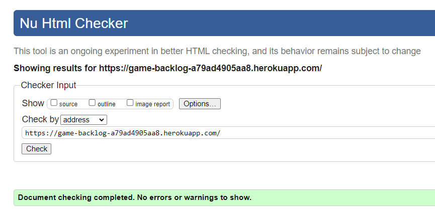
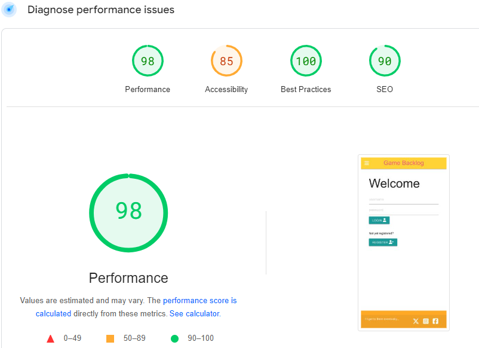
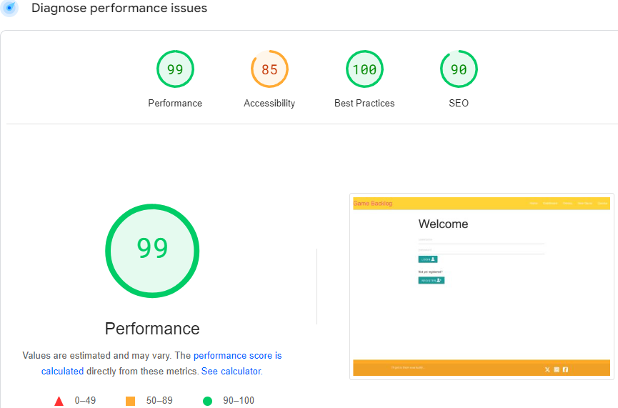

# Game Backlog

Game Backlog is a site to compile a list of games that you have yet to play or want to play again.

## Live Project

[View Game Backlog here.](https://game-backlog-a79ad4905aa8.herokuapp.com/)

## User Experience 

- ### User Stories

- #### First Time Visitor Goals

    1. As a first time visitor, I want to be able to register for an account.
    2. As a first time visitor, I want to be able to easily navigate the site.
    3. As a first time visitor, I want to be able to view the website on any device.

- #### Returning Visitor Goals

    1. As a returning visitor, I want to be able to log in to my account.
    2. As a returning visitor, I want to be able to see what games have been added by non registered users
    3. As a returning visitor, I want to be able to edit and delete games and genres.

- #### Frequent Visitor Goals

    1. As a frequent visitor, I would like to see my own list of games added.
    2. As a frequent visitor, I would like my list to be only visible to me.

- ### Design
    - #### Colour Scheme
        - The main colours of the website are yellow/orange and dark pink. This is just to give an overall lighthearted feel to the list.

## Features
### Existing Features

- __Home Page__
  - The homepage is where you are welcomed to the site and have access to login or register.

  

- __Nav Bar__
  - The navbar has links to the other pages of the website for easy navigation.

    
  

- __Dashboard__

    - The dashboard displays when a user is logged in and gives an error message when logged out.

      

    

- __Games Page__
    - The games page shows a dropdown of the games added to website, their genre, description and release date entered by users.
    These are able to be edited and deleted.

    
  
- __Modal__
  - The modal pops up when you try to delete a game or genre to double check and confirm your input.

  

-__Add Game Page__
  - This page is where the user enters information about the new game they are adding to the backlog, including the title, a description and release date etc.

  

- __Genre Page__
  - This page displays all the genres that have been added to the backlog, the games added are then stored under their respective genre chosen.

  

## Future Features

 - I would like to add each individual users entered games into their own backlog list that will be displayed on the logged in users dashboard. They can then edit this list from within the dashboard menu.

 - From the users dashboard it would be nice if there was an option to only display the favourited games or perhaps games from only a specific genre chosen.

 - Currently there are no messages to show an error when a duplicate of a game or genre is input into the database, as it stands the user is just redirected to the respective page with no changes applied.

 - As of now, you have to choose a genre from the existing dropdown menu when adding a game. This means the genre has to be created first before adding a game. It would be better if you could enter a genre while adding a game and then the genre data would be added to the database list.

## Testing

- HTML
    - No errors were returned when passing through the official [W3C validator](https://validator.w3.org/). This was done for every html page created.
    

- Accessibility
  - This was checked using the free tool on this [site](https://pagespeed.web.dev/)
    
  

## Known Bugs
 - When on mobile/tablet the select menu to choose a genre when adding or editing a game does not always set the right value when clicked, however this seems to work fine on desktop.

# Deployment

## Creating a Gitpod Workspace

The project was created in Gitpod using the Code Institute Gitpod Full Template using these steps:

1. Log in to GitHub and go to the [Code Institute student template for Gitpod](https://github.com/Code-Institute-Org/ci-full-template)
2. Click 'Use this Template' next to the Green Gitpod button.
3. Add a repository name and click 'Create reposiory from template'.
4. This will create a copy of the template in your own repository. Now you can click the green 'Gitpod' button to open a workspace in Gitpod.

## Forking a GitHub Repository
  1. Login to GitHub.
  2. Locate your desired repository.
  3. Locate the fork option in the top-right hand corner of the repository page.    
  4. You will be asked where you want to fork it to.

## Cloning a repository using the command line
  1. On GitHub, navigate to the main page of the repository.
  2. Above the list of files, click download code.
  3. To clone the repository using HTTPS, under "Clone with HTTPS", click the copy icon. To clone the repository using an SSH key, including a certificate issued by your organization's SSH certificate authority, click *Use SSH*, then click the copy icon. To clone a repository using GitHub CLI, click Use *GitHub CLI*, then click the copy icon.
  4. Open Terminal.
  5. Change the current working directory to the location where you want the cloned directory.
  6. Type ```git clone```, and then paste the URL you copied earlier.

      ```
      $ git clone https://github.com/YOUR-USERNAME/YOUR-REPOSITORY
      ```

  7. Press Enter to create your local clone.

      ```
      $ git clone https://github.com/YOUR-USERNAME/YOUR-REPOSITORY
      ```
      ```
      \> Cloning into \`Spoon-Knife`\...

      \> remote: Counting objects: 10, done.

      \> remote: Compressing objects: 100% (8/8), done.

      \> remove: Total 10 (delta 1), reused 10 (delta 1)

      \> Unpacking objects: 100% (10/10), done.
      ```

## Creating an application with Heroku

You will need to deploy the application using Heroku.

1. Create a requirements.txt file by typing ``` pip freeze --local > requirements.txt ``` into the Gitpod CLI. 
2. Create a Procfile by creating a new file in the root directory of your project called 'Procfile'. Ensure it starts with a capital P. Open it and write ```web: python run.py ``` ensure it doesn't have a new line, as this can create errors. 
3. Add and commit these files to Github.
4. Go to [Heroku](https://dashboard.heroku.com/apps). Log in or create an account
5. Click the 'New' button and click 'Create new app'.
6. Enter a unique name for your project with no capital letters or spaces and select your region. Click 'Create App'.
7. Inside your project, go to the 'Settings' tab. Scroll down and click 'Reveal Config Vars'.
8. Add in the following variables
  - DATABASE_URL : Your database url
  - IP : 0.0.0.0
  - PORT : 5000
  - SECRET_KEY : Your secret key
9. Deploy your project by going to the Deploy tab and choose 'Connect to Github'
10. Find your repository name and select Connect.
11. To connect your Heroku database, go to 'More' in the top right and select run console. Enter ```python3``` to access the python intepreter.
12. Then type ```From gamebacklog import db```. Then type ```db.create_all()```. You can then exit the console.


## Credits
 * Majority of code was used from the code institute walkthrough project
 * Materialize CSS was used for the style of the web pages
 * Font awesome was used to display icons on buttons and forms
 * User authentication was learnt from the following [Youtube video](https://www.youtube.com/watch?v=t9zA1gvrTvo&t=10s)