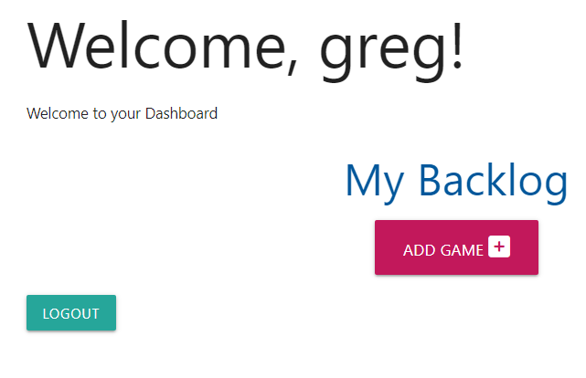

# Game Backlog

Game Backlog is a site to compile a list of games that you have yet to play or want to play again.

## User Experience 

- ### User Stories

- #### First Time Visitor Goals

    1. As a first time visitor, I want to be able to register for an account.
    2. As a first time visitor, I want to be able to easily navigate the site.
    3. As a first time visitor, I want to be able to view the website on any device.

- #### Returning Visitor Goals

    1. As a returning visitor, I want to be able to log in to my account.
    2. As a returning visitor, I want to be able to see what games have been added by non registered users
    3. As a returning visitor, I want to be able to edit and delete games and genres.

- #### Frequent Visitor Goals

    1. As a frequent visitor, I would like to see my own list of games added.
    2. As a frequent visitor, I would like my list to be only visible to me.

- ### Design
    - #### Colour Scheme
        - The main colours of the website are yellow/orange and dark pink. This is just to give an overall lighthearted feel to the list.

## Features
### Existing Features

- __Home Page__
  - The homepage is where you are welcomed to the site and have access to login or register.

  

- __Nav Bar__
  - The navbar has links to the other pages of the website for easy navigation.

    
  

- __Dashboard__

    - The dashboard displays when a user is logged in and gives an error message when logged out.

      

    

- __Games Page__
    - The games page shows a dropdown of the games added to website, their genre, description and release date entered by users.
    These are able to be edited and deleted.

    
  
- __Modal__
  - The modal pops up when you try to delete a game or genre to double check and confirm your input.

  

-__Add Game Page__
  - This page is where the user enters information about the new game they are adding to the backlog, including the title, a description and release date etc.

  

- __Genre Page__
  - This page displays all the genres that have been added to the backlog, the games added are then stored under their respective genre chosen.

  

## Future Features

 - I would like to add each individual users entered games into their own backlog list that will be displayed on the logged in users dashboard. They can then edit this list from within the dashboard menu.

 - From the users dashboard it would be nice if there was an option to only display the favourited games or perhaps games from only a specific genre chosen.

## Testing